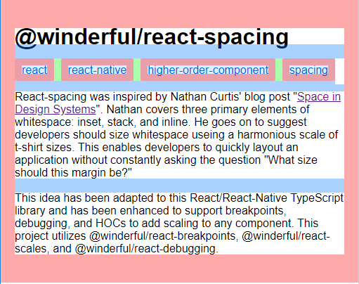
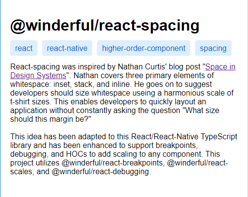

# @winderful/react-spacing

React-spacing was inspired by Nathan Curtis' blog post "[Space in Design Systems](https://medium.com/eightshapes-llc/space-in-design-systems-188bcbae0d62)". Nathan covers three primary elements of whitespace: inset, stack, and inline. He goes on to suggest developers should size this whitespace using a harmonious scale of t-shirt sizes. Using these spacial components with only a few sizes enables developers to layout applications more quickly and with greater quality.

## Installation (_NPM Coming Soon_)

```
npm install github:nathanwinder/react-spacing
```

```
yarn add github:nathanwinder/react-spacing
```

## Features

- Layout components using a set of three spacial elements:
  1. Inset - A border around content (Red)
  2. Inline - Horizontal space to the left or right of elements (Green)
  3. Stack - Vertical space above or below elements (Blue)

```html
const App = () => (
<Inset all={40}>
    <h1>Title<h1>
    <Stack value={10}/>
    <ul style={{display: "flex", flexDirection: "row" }}>
        <li>item 1</li>
        <Inline value={5}/>
        <li>item 2</li>
        <Inline value={5}/>
        <li>item 3</li>
    <ul>
<Inset>
)
```

- Find issues quickly with debug colors.

```html
<Inset all={40} debug={true}>
   ...
<Inset>
```




- Use @winderful/react-debugging to turn entire trees of elements on and off.

```typescript
import { createDebugContext, withDebugProps } from "@winderful/react-debugging";
import * as spacing from "@winderful/react-spacing";

const DebugContext = createDebugContext(true);

const Inset = withDebugProps(spacing.Inset, DebugContext);
```

```html
// debugging enabled for all child components
<Inset all={40} debugOptions={{ debugChildren: true }}>
    <h1>Title<h1>
    <Stack value={10}/>
    <ul style={{display: "flex", flexDirection: "row" }}>
        <li>item 1</li>
        <Inline value={5}/>
        <li>item 2</li>
        // disable debugging for this component
        <Inline value={5} debug={false}/>
        <li>item 3</li>
    <ul>
<Inset>
```

- Use @winderful/react-scales to define spacing scales

```typescript
import { createScaleContext, withScaleProps } from "@winderful/react-scales";
import * as spacing from "@winderful/react-spacing";

const ScaleContext = createScaleContext({ s: 10, m: 20, l: 40 });

const Inset = withScaleProps(
  spacing.Inset,
  ScaleContext,
  spacing.Inset.sizeProps
);
```

```html
<Stack value="m"/>
<Stack value={15}/>
```

- Use @winderful/react-breakpoints to set size based on breakpoint

```typescript
import {
  createBreakpointContext,
  withBreakpointProps
} from "@winderful/react-breakpoints";
import * as spacing from "@winderful/react-spacing";

const BreakpointContext = createBreakpointContext(
  window,
  () => (window.innerWidth < 768 ? "mobile" : "tablet")
);

const Inset = withBreakpointProps(
  spacing.Inset,
  BreakpointContext,
  spacing.Inset.sizeProps
);
```

```html
<Stack value={{ mobile: 10, tablet: 20 }}/>
<Stack value={15}/>
```

- Use @winderful/react-debugging, @winderful/react-breakpoints, and @winderful/react-scales together.

```typescript
const Inset = withDebugProps(
  withBreakpointProps(
    withScaleProps(spacing.Inset, ScaleContext, ...spacing.Inset.sizeProps),
    BreakpointContext,
    ...spacing.Inset.sizeProps
  ),
  DebugContext
);
```

```html
<Inset all={{ mobile: "m", tablet: "l" }} bottom={5} debug={true} debugOptions={{debugChildren: true}}>
    <h1>Title</h1>
    <Stack value="m"/>
    <p>...</p>
</Inset>
```
